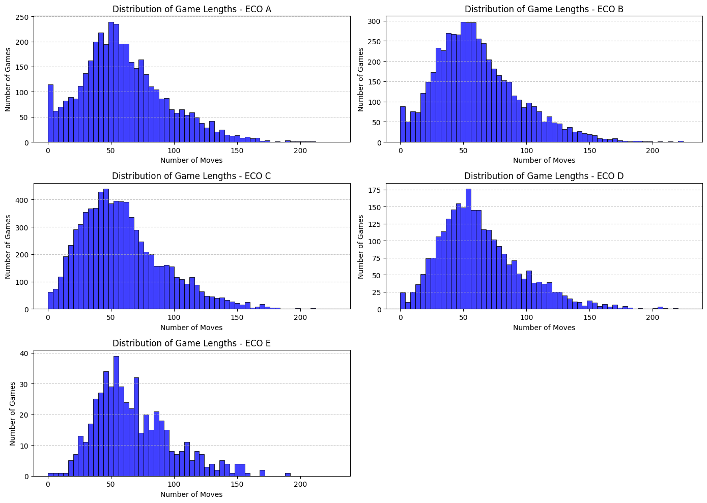

# chessBase_features_reproducing  <br>

 <br>
 <br>
 <br>

```sql
USE chessdb;
CREATE TABLE ECO_CODES(
	ECO_Code VARCHAR(5),
    Opening VARCHAR(40),
    Moves VARCHAR(200 )
);
COMMIT;
ALTER TABLE ECO_CODES
ADD COLUMN ECO_ID INT AUTO_INCREMENT PRIMARY KEY;commit;

DROP TABLE GAMES_1990; COMMIT;

CREATE TABLE GAMES_1990(
    id INT PRIMARY KEY AUTO_INCREMENT,
    White VARCHAR(50),
    Black VARCHAR(50),
    Result VARCHAR(7),
    Event VARCHAR(50),
    Date DATE
);commit;

# MOVES_1990_ underscore table
CREATE TABLE MOVES_1990_(
    game_id INT,
    Moves VARCHAR(3000),
    FOREIGN KEY (game_id) REFERENCES GAMES_1990(id)
);commit;


SELECT * FROM ECO_CODES;
COMMIT;
show tables;
SELECT * FROM games_1990;
COMMIT;
SELECT * FROM moves_1990_;
COMMIT;

ALTER TABLE GAMES_1990
ADD COLUMN Moves VARCHAR(3000);

UPDATE GAMES_1990 AS G
JOIN TEMP_MOVES AS T ON G.White = T.White AND G.Black = T.Black AND G.Date = T.Date
SET G.Moves = T.Moves
WHERE G.id IS NOT NULL;

DELETE
FROM games_1990
WHERE id IS NULL;
commit;


SELECT COUNT(*)
FROM games_1990
WHERE id IS NULL;

SET SQL_SAFE_UPDATES = 0;

DELETE FROM games_1990 WHERE White IS NULL AND Black IS NULL AND Result IS NULL
AND Event IS NULL AND Date IS NULL AND Moves IS NOT NULL; commit;

SELECT *
FROM ECO_CODES;

# Replace the apostrophe with a space in ECO_CODES table
UPDATE ECO_CODES
SET Opening = REPLACE(Opening, '’', ' ')
WHERE Opening LIKE '%’%';commit;

# Link table between games_1990 and ECO_CODES via ECO_code and game_id, as the two tables had no common columns.
# (Following a normal form process, with the usage of foreign keys, and not adding an ECO_Code column
# directly to the games_1990 table,which would mix the datas ).
CREATE TABLE game_opening_map (
    game_id INT,
    ECO_Code VARCHAR(10),
    PRIMARY KEY (game_id, ECO_Code),
    FOREIGN KEY (game_id) REFERENCES games_1990(id),
    FOREIGN KEY (ECO_Code) REFERENCES ECO_CODES(ECO_Code)
);commit;

CREATE TABLE game_opening_map (
    game_id INT,
    ECO_ID INT,
    PRIMARY KEY (game_id, ECO_ID),
    FOREIGN KEY (game_id) REFERENCES games_1990(id),
    FOREIGN KEY (ECO_ID) REFERENCES ECO_CODES(ECO_ID)
);commit;
# Populate the linking table with corresponding IDs
INSERT INTO game_opening_map (game_id, ECO_ID)
SELECT g.id, e.ECO_ID
FROM games_1990 g
JOIN ECO_CODES e
ON g.Moves LIKE CONCAT(e.Moves, '%');commit;

select *
from game_opening_map;

SELECT g.id, g.White, g.Black, g.Result, g.Event, g.Date, g.Moves, m.ECO_ID, e.ECO_Code, e.Opening
FROM games_1990 g
JOIN game_opening_map m ON g.id = m.game_id
JOIN ECO_CODES e ON m.ECO_ID = e.ECO_ID;commit;

# VIEW CREATION AS THIS REQUEST IS A RESULT COMPUTATION (continuing the normalized form process)
CREATE VIEW game_opening_details AS
SELECT g.id, g.White, g.Black, g.Result, g.Event, g.Date, g.Moves, m.ECO_ID, e.ECO_Code, e.Opening
FROM games_1990 g
JOIN game_opening_map m ON g.id = m.game_id
JOIN ECO_CODES e ON m.ECO_ID = e.ECO_ID;COMMIT;

SELECT * FROM game_opening_details;commit;

# Adding two more columns for adding ratings(ELO) white and black
ALTER TABLE games_1990
ADD COLUMN white_rating INT,
ADD COLUMN black_rating INT;
COMMIT;

# Temp table for import 
CREATE TABLE temp_elo_data (
    id INT,
    White VARCHAR(50),
    Black VARCHAR(50),
    Date DATE,
    white_rating INT,
    black_rating INT
);
COMMIT;

SELECT * FROM temp_elo_data;

SET SQL_SAFE_UPDATES = 0;

#CREATE INDEX idx_games_white_black_date ON games_1990 (White, Black, Date);
#CREATE INDEX idx_temp_elo_white_black_date ON temp_elo_data (White, Black, Date);

SET GLOBAL connect_timeout = 1200;
SET GLOBAL wait_timeout = 1200;
SET GLOBAL interactive_timeout = 1200;

CREATE INDEX idx_temp_elo_white ON temp_elo_data (White);
CREATE INDEX idx_temp_elo_black ON temp_elo_data (Black);
CREATE INDEX idx_temp_elo_date ON temp_elo_data (Date);

UPDATE games_1990 AS g
JOIN temp_elo_data AS t
ON g.White = t.White AND g.Black = t.Black AND g.Date = t.Date
SET g.white_rating = t.white_rating,
    g.black_rating = t.black_rating;
COMMIT;

``` 

## Filtering work: <br>
```python
# After inspecting the result, i will try to remove rows that doesn’t start with « 1. » 
# Problem : it doesnt appear in my DataFrame but it appears in my LibreOffice file...So if it 
# is not deleted in the table i will try to remove it with SQL.
 # Step 1: Remove any extraneous whitespace and hidden characters from 'Moves' column
df['Moves'] = df['Moves'].str.strip()

# Step 2: Filter rows to keep only those starting with "1." in the 'Moves' column
df_filtered = df[df['Moves'].str.match(r'^1\.\s', na=False)]

# Display the filtered DataFrame
display(df_filtered)
# Conversion to csv:
df.to_csv("ECO_code_mapping.csv")
```
